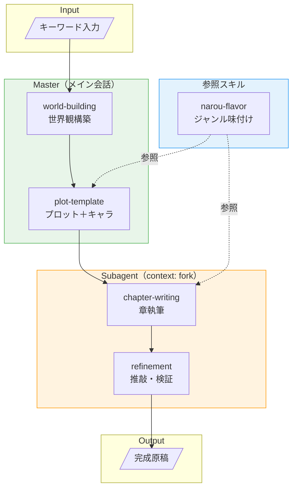

# 小説生成工場 ワークフロー v1

## 設計思想

### master / subagent の分離基準

| 層 | 処理タイプ | 特徴 |
|:--|:--|:--|
| **master** | 設計・定義系 | 一発で決まる、コンテキストを汚さない |
| **subagent** | 実装・精製系 | 試行錯誤が必要、長い、反復的 |

### なぜ分けるか

- サブエージェントは他のサブエージェントを呼び出せない制約がある
- メインコンテキストで出力できるものはメインで行う方が効率的
- 重い処理（執筆・推敲）のみ `context: fork` で分離

---

## ワークフロー図



---

## 各層の役割

### Master層（メイン会話で実行）

| ステップ | 入力 | 出力 | スキル参照 |
|:--|:--|:--|:--|
| world-building | キーワード | 世界観設定 | - |
| plot-template | 世界観設定 | プロット骨子 + キャラ（必要に応じて） | narou-flavor |

**特徴**: 設計フェーズ。一度決めたら変わらない土台を作る。キャラクターはプロット構築時に必要なら定義する（名前なしでも可）。

### Subagent層（context: fork で実行）

| ステップ | 入力 | 出力 | スキル参照 |
|:--|:--|:--|:--|
| chapter-writing | プロット骨子 | 章の本文 | narou-flavor |
| refinement | 章の本文 | 推敲済み本文 | - |

**特徴**: 実装フェーズ。長文生成・反復修正が発生する。

---

## ファイル構成

```
.claude/
  skills/
    # Master用
    world-building/
      SKILL.md
    plot-template/
      SKILL.md

    # 参照スキル（user-invocable: false）
    narou-flavor/
      SKILL.md

    # Subagent用（context: fork）
    chapter-writing/
      SKILL.md              # context: fork 設定
    refinement/
      SKILL.md              # context: fork 設定

    # 補助スキル
    naming/
      SKILL.md              # 必要に応じて名前生成

outputs/
  <project-id>/             # プロジェクト単位で分離
    input.md                # 入力キーワード・指示の保存
    worldview.md            # Master出力: 世界観
    plot.md                 # Master出力: プロット
    characters.md           # Master出力: キャラクター（任意）
    chapters/
      01.md                 # Subagent出力: 各章
      02.md
      ...
    final.md                # 最終成果物（結合済み）
```

### プロジェクトID規則

```
<project-id> = YYYYMMDD-HHMMSS_<slug>
例: 20260129-173500_isekai-cheat
```

- タイムスタンプで一意性を担保
- slugは入力キーワードから自動生成（日本語→ローマ字 or 英訳）
- 同一入力での再生成も別プロジェクトとして保存

---

## 補足: context: fork の動作

```yaml
# chapter-writing/SKILL.md
---
name: chapter-writing
description: 章の本文を執筆する
context: fork              # サブエージェントとして実行
agent: general-purpose
---

プロット骨子に基づき、指定された章を執筆せよ。
...
```

- `context: fork` により独立したコンテキストで実行
- メインの会話履歴を汚さない
- 結果のみがメインに返る

---

## 今後の検討事項

- [ ] 各スキルの具体的な内容設計
- [ ] 出力フォーマットの標準化
- [ ] 章間の整合性チェック方法
- [ ] ワークフロー呼び出し用コマンドの設計
