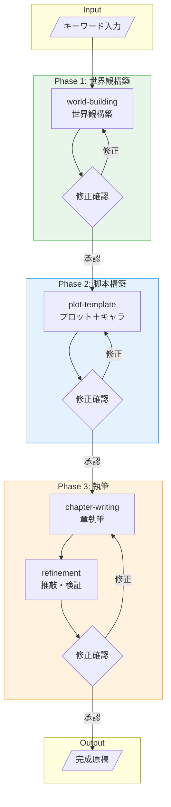

# 小説生成工場 ワークフロー v2

## 設計思想

### v1からの変更点

- **各段階に修正確認フェーズを追加**: 世界観・脚本・執筆それぞれで承認を得てから次へ進む
- **イテレーション重視**: 一発で決めず、フィードバックループを回す

### master / subagent の分離基準

| 層 | 処理タイプ | 特徴 |
|:--|:--|:--|
| **master** | 設計・定義系 | 確認と修正を繰り返す、対話的 |
| **subagent** | 実装・精製系 | 長文生成、重い処理 |

---

## ワークフロー図



---

## 各フェーズの詳細

### Phase 1: 世界観構築（Master）

| ステップ | 入力 | 出力 | 実行層 |
|:--|:--|:--|:--|
| world-building | キーワード | 世界観設定 | Master |
| 修正確認 | 世界観設定 | 承認 or 修正指示 | Master |

**フロー**:
1. キーワードから世界観を構築
2. ユーザーに提示して確認
3. 修正があれば反映して再提示
4. 承認されたら次フェーズへ

### Phase 2: 脚本構築（Master）

| ステップ | 入力 | 出力 | 実行層 |
|:--|:--|:--|:--|
| plot-template | 世界観設定 | プロット骨子 + キャラ | Master |
| 修正確認 | プロット | 承認 or 修正指示 | Master |

**フロー**:
1. 世界観からプロットとキャラクターを構築
2. ユーザーに提示して確認
3. 修正があれば反映して再提示
4. 承認されたら次フェーズへ

### Phase 3: 執筆（Subagent）

| ステップ | 入力 | 出力 | 実行層 |
|:--|:--|:--|:--|
| chapter-writing | プロット骨子 | 章の本文 | Subagent |
| refinement | 章の本文 | 推敲済み本文 | Subagent |
| 修正確認 | 推敲済み本文 | 承認 or 修正指示 | Master |

**フロー**:
1. プロットに基づいて章を執筆
2. 推敲・検証を実行
3. ユーザーに提示して確認
4. 修正があれば再執筆
5. 承認されたら完成

---

## 修正確認のポイント

### 世界観構築時

- 世界の雰囲気は意図通りか
- スコープは適切か（広すぎ/狭すぎ）
- 活用タイプ（ギミック/舞台/テーマ）は合っているか

### 脚本構築時

- ビート構成は面白いか
- キャラクターの動機は明確か
- 結末のトーンは望み通りか

### 執筆時

- 文体は適切か
- 描写の密度は適切か
- 物語のテンポは良いか

---

## ファイル構成

```
outputs/
  <project-id>/
    input.md          - 入力キーワード・指示
    worldview.md      - Phase 1 出力: 世界観（承認済み）
    plot.md           - Phase 2 出力: プロット（承認済み）
    characters.md     - Phase 2 出力: キャラクター（任意）
    chapters/
      01.md           - Phase 3 出力: 各章
      02.md
      ...
    final.md          - 最終成果物（結合済み）
```

### プロジェクトID規則

```
<project-id> = YYYYMMDD-HHMMSS_<slug>
例: 20260129-173500_isekai-cheat
```
